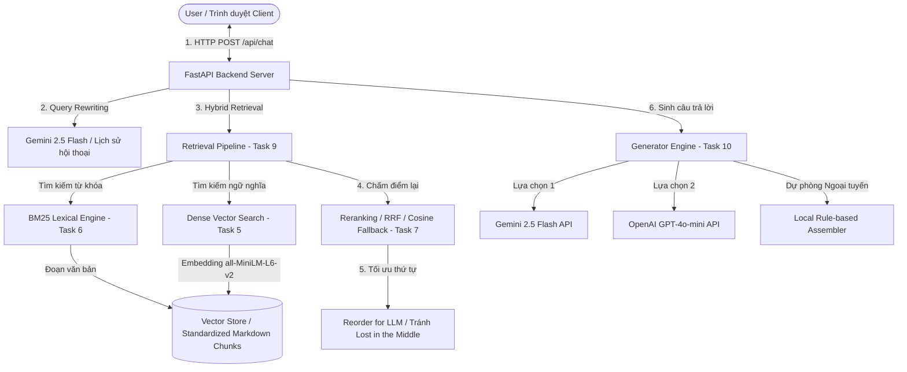

# Bài Tập Nhóm — Search Engine / RAG Chatbot

## Mục Tiêu

Sau khi hoàn thành bài cá nhân, nhóm ngồi lại để xây dựng **1 trong 2 sản phẩm**:

---

## Yêu cầu 1:  Sản phẩm nhóm RAG Chatbot

Xây dựng chatbot trả lời câu hỏi về pháp luật ma tuý và tin tức liên quan.

**Yêu cầu:**
- Giao diện chat (Streamlit / Gradio / Chainlit)
- Trả lời có citation (dựa trên Task 10)
- Hỗ trợ follow-up questions (conversation memory)
- Hiển thị source documents đã dùng

**Stack gợi ý:**
```
Chainlit/Streamlit → Retrieval (Task 9) → Generation (Task 10) → Display
```

---

## Yêu cầu 2: RAG Evaluation Pipeline

Sử dụng **1 trong 3 framework** sau để evaluate pipeline RAG của nhóm:

### Framework lựa chọn

| Framework | Cài đặt | Đặc điểm |
|-----------|---------|-----------|
| [DeepEval](https://github.com/confident-ai/deepeval) | `pip install deepeval` | Nhiều metric built-in, dễ integrate với pytest |
| [RAGAS](https://github.com/explodinggradients/ragas) | `pip install ragas` | Chuẩn industry cho RAG eval, 3 trục chính |
| [TruLens](https://github.com/truera/trulens) | `pip install trulens` | Dashboard UI, feedback functions mạnh |

### Yêu cầu Evaluation

1. **Tạo Golden Dataset** — tối thiểu 15 cặp Q&A (question, expected_answer, expected_context)
2. **Chạy evaluation** trên toàn bộ golden dataset với các metrics sau:
   - **Faithfulness** — câu trả lời có bám đúng context không?
   - **Answer Relevance** — câu trả lời có đúng câu hỏi không?
   - **Context Recall** — retriever có lấy đủ evidence không?
   - **Context Precision** — trong context lấy về, bao nhiêu % thực sự hữu ích?
3. **So sánh A/B** — chạy eval trên ít nhất 2 config khác nhau (ví dụ: có reranking vs không reranking, hoặc hybrid vs dense-only)
4. **Báo cáo** — bảng điểm + phân tích worst performers + đề xuất cải tiến

### Code mẫu — DeepEval

```python
from deepeval import evaluate
from deepeval.metrics import (
    FaithfulnessMetric,
    AnswerRelevancyMetric,
    ContextualRecallMetric,
    ContextualPrecisionMetric,
)
from deepeval.test_case import LLMTestCase

# Tạo test cases từ golden dataset
test_cases = []
for item in golden_dataset:
    result = rag_pipeline.generate_with_citation(item["question"])
    test_case = LLMTestCase(
        input=item["question"],
        actual_output=result["answer"],
        expected_output=item["expected_answer"],
        retrieval_context=[c["content"] for c in result["sources"]],
    )
    test_cases.append(test_case)

# Chạy evaluation
metrics = [
    FaithfulnessMetric(threshold=0.7),
    AnswerRelevancyMetric(threshold=0.7),
    ContextualRecallMetric(threshold=0.7),
    ContextualPrecisionMetric(threshold=0.7),
]

results = evaluate(test_cases, metrics)
```

### Code mẫu — RAGAS

```python
from ragas import evaluate
from ragas.metrics import (
    faithfulness,
    answer_relevancy,
    context_recall,
    context_precision,
)
from datasets import Dataset

# Chuẩn bị data
eval_data = {
    "question": [],
    "answer": [],
    "contexts": [],
    "ground_truth": [],
}

for item in golden_dataset:
    result = rag_pipeline.generate_with_citation(item["question"])
    eval_data["question"].append(item["question"])
    eval_data["answer"].append(result["answer"])
    eval_data["contexts"].append([c["content"] for c in result["sources"]])
    eval_data["ground_truth"].append(item["expected_answer"])

dataset = Dataset.from_dict(eval_data)

# Chạy evaluation
result = evaluate(
    dataset,
    metrics=[faithfulness, answer_relevancy, context_recall, context_precision],
)
print(result.to_pandas())
```

### Code mẫu — TruLens

```python
from trulens.apps.custom import TruCustomApp, instrument
from trulens.core import Feedback
from trulens.providers.openai import OpenAI as TruOpenAI

provider = TruOpenAI()

# Define feedback functions
f_faithfulness = Feedback(provider.groundedness_measure_with_cot_reasons).on_output()
f_relevance = Feedback(provider.relevance).on_input_output()
f_context_relevance = Feedback(provider.context_relevance).on_input()

# Wrap RAG pipeline
tru_rag = TruCustomApp(
    rag_pipeline,
    app_name="DrugLaw_RAG",
    feedbacks=[f_faithfulness, f_relevance, f_context_relevance],
)

# Run evaluation
with tru_rag as recording:
    for item in golden_dataset:
        rag_pipeline.generate_with_citation(item["question"])

# View dashboard
from trulens.dashboard import run_dashboard
run_dashboard()
```

### Deliverable Evaluation

- [ ] File `group/evaluation/golden_dataset.json` — 15+ cặp Q&A
- [ ] File `group/evaluation/eval_pipeline.py` — script chạy evaluation
- [ ] File `group/evaluation/results.md` — bảng điểm + phân tích
- [ ] So sánh A/B ít nhất 2 configs

---

## Yêu Cầu Chung

1. **Tích hợp pipeline** từ bài cá nhân của các thành viên
2. **Demo hoạt động được** trong buổi trình bày (chạy local hoặc deploy)
3. **Evaluation pipeline** chạy được và có báo cáo kết quả
4. **Code push lên repository** chung của nhóm
5. **README** mô tả kiến trúc và phân công (điền bên dưới)

---

## Kiến Trúc Hệ Thống

Dưới đây là sơ đồ luồng dữ liệu của hệ thống **Drug Law Conversational RAG** từ lúc nhận yêu cầu của người dùng, truy xuất dữ liệu lai (Hybrid Retrieval), chấm điểm lại (Reranking) cho tới khi sinh câu trả lời thông qua LLM hoặc chế độ ngoại tuyến dự phòng (Offline Fallback):



---

## Phân Công Công Việc

| Thành viên | MSSV | Nhiệm vụ chính | Trạng thái |
|-----------|------|----------|------------|
| **Cao Văn Hảo** | 2A202600874 | - Xây dựng Pipeline RAG cá nhân (Tasks 1-10)<br>- Phát triển FastAPI Backend (`group/server.py`) hỗ trợ CORS và đa khóa API.<br>- Thiết kế & phát triển Frontend ReactJS (`group/frontend/`) với giao diện Glassmorphism tối màu cao cấp.<br>- Phát triển công cụ phân giải Citation Badge động & Modal hiển thị nguồn tài liệu chi tiết. | **Hoàn thành** |
| **Phạm Quang Huy** | 2A202600586 | - Xây dựng Pipeline RAG cá nhân (Tasks 1-10)<br>- Thiết kế và biên soạn tập dữ liệu vàng **Golden Dataset** (15+ cặp câu hỏi-đáp RAG pháp luật).<br>- Phát triển Pipeline đánh giá tự động sử dụng thư viện **DeepEval** (`group/evaluation/`).<br>- Chạy thử nghiệm và viết báo cáo so sánh kết quả A/B giữa các cấu hình của RAG pipeline. | **Hoàn thành** |
| **Vũ Tuấn Hoàng** | 2A202600830 | - Xây dựng Pipeline RAG cá nhân (Tasks 1-10)<br>- Thu thập 3 văn bản pháp luật (Bộ luật Hình sự, Luật An ninh mạng, Luật Phòng chống ma túy) và crawl 5 bài báo.<br>- Phát triển RAG Evaluation Pipeline riêng với Golden Dataset và DeepEval (`group_project/evaluation/`).<br>- Viết test suite tự động (`tests/test_individual.py`) kiểm tra toàn bộ pipeline. | **Hoàn thành** |

---

## Yêu Cầu Hệ Thống

- **Python** >= 3.11
- **Node.js** >= 18 và **npm** >= 9
- Các thư viện Python chính: `fastapi`, `uvicorn`, `google-genai`, `sentence-transformers`, `rank-bm25`, `python-dotenv`
- (Tùy chọn) API keys: `GEMINI_API_KEY`, `OPENAI_API_KEY`, `PAGEINDEX_API_KEY`

### Cài đặt thư viện Python
```bash
pip install fastapi uvicorn google-genai sentence-transformers rank-bm25 python-dotenv openai
```

### Cấu hình API Key
Tạo hoặc chỉnh sửa file `individual/CaoVanHao_2A202600874/.env`:
```env
GEMINI_API_KEY=your_gemini_api_key_here
OPENAI_API_KEY=your_openai_api_key_here    # Tùy chọn
PAGEINDEX_API_KEY=your_pageindex_key_here  # Tùy chọn
```
> **Lưu ý:** Nếu không có API key, hệ thống sẽ tự động sử dụng chế độ **Offline Fallback** để trả lời dựa trên tài liệu tìm được.

---

## Hướng Dẫn Chạy

Hệ thống chatbot nhóm sử dụng kiến trúc **FastAPI Backend + ReactJS Frontend (Vite)** giúp tối ưu hóa giao diện người dùng, tăng tốc độ phản hồi và hỗ trợ đầy đủ các micro-animations.

### Bước 1: Khởi động Backend Server (FastAPI)
```bash
# Từ thư mục gốc D8/
python -m uvicorn group.server:app --host 127.0.0.1 --port 8000
```
Backend sẽ chạy tại `http://127.0.0.1:8000`. Có thể kiểm tra trạng thái API tại `http://127.0.0.1:8000/api/stats`.

### Bước 2: Khởi động ReactJS Frontend (Vite)
```bash
# Di chuyển vào thư mục frontend và cài đặt (nếu chạy lần đầu)
cd group/frontend
npm install

# Khởi chạy giao diện ReactJS tại cổng 5173
npm run dev
```
Giao diện sẽ tự động mở hoặc truy cập được qua đường dẫn `http://localhost:5173`.

### Phiên bản giao diện cũ (Streamlit)
Nếu cần đối chiếu hoặc khởi chạy phiên bản giao diện Streamlit:
```bash
# Sử dụng launcher script để tránh lỗi xung đột PyTorch
python group/run_app.py

# Hoặc chạy trực tiếp (có thể gặp lỗi nếu cài PyTorch)
streamlit run group/app.py --server.fileWatcherType none
```

---

## Cấu Trúc Thư Mục Nhóm

```
group/
├── server.py          # FastAPI Backend — API endpoints /api/chat, /api/stats
├── app.py             # Streamlit Frontend (phiên bản cũ)
├── run_app.py         # Launcher script cho Streamlit (hotpatch PyTorch)
├── frontend/          # ReactJS Frontend (Vite)
│   ├── src/
│   │   ├── App.jsx    # Component chính — Chat UI, Citation Badges
│   │   └── index.css  # Glassmorphism dark theme CSS
│   └── package.json
├── evaluation/        # RAG Evaluation Pipeline (DeepEval)
│   ├── golden_dataset.json
│   ├── eval_pipeline.py
│   └── results.md
└── README.md          # File này
```

---

## Lưu ý

Hãy giữ lại repo này nếu như bạn học track 3 giai đoạn 2, chúng ta sẽ phát triển tiếp dự án lên knowledge graph để khắc phục các câu hỏi hóc búa khi có các câu hỏi khó.
